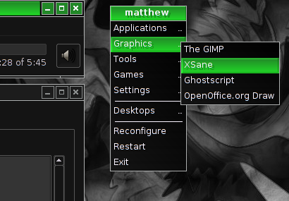
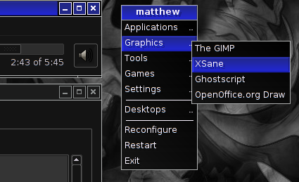
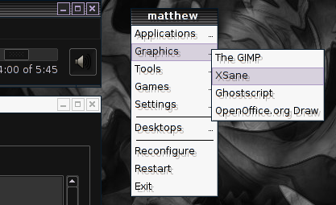
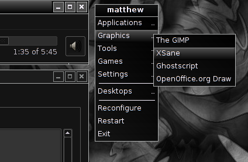

# starbreaker-xorg-themes

These are old themes for Openbox, GTK 1.x, and GTK 2.x that I originally 
created back in 2003 and offered to the public on starbreaker.net, a domain
I lost control of shortly after I got married in 2004.

They got archived on the Wayback Machine, where they eventually caught the
attention of a Devuan developer who asked me to place them under source control
so that they could more easily be packaged.

I have tested these themes under Devuan Ascii (Testing) using Openbox 3.6.1 
and lxappearance 0.6.3, and can confirm that these themes remain compatible 
with Openbox and GTK 2.x.

## Installation

You should be able to clone this repository to a convenient location, 
and then copy the theme folders to one of the following directories.

* $HOME/.themes/
* $HOME/.local/share/themes/

You can also use the included ```install.sh``` script.

Watch this space for distribution-specific installation instructions.

## Removal

I've included an ```uninstall.sh``` shell script for your convenience. Just run it from your terminal.

## Themes Included

The "Starbreaker" X.org themes pack includes seven themes that I created after
listening to way too much power metal.

### Preternatural

This is a dark theme with neon-violet highlights. Unfortunately, the Wayback
Machine didn't preserve a screenshot.

### Infrared

While Preternatural possesses a serene violet-silver glow, Infrared glows hot 
with scarlet highlights. No screenshot yet.

### Biomechanical

Green on black. Perfect for that old-school look. See for yourself.



### Visible Spectrum

For all the Stryper fans, here's a yellow on black attack. Unfortunately, I'll
need to create a screenshot.

### Energistic

I must have been reading Peter F. Hamilton's *Night's Dawn* trilogy when I 
needed a name for *this* theme. Blue on black.



### Foxfire

Apparently this was a variation on a theme called [Light Industrial](web.archive.org/web/20040103073933/http://home.clara.co.uk/dpb/openbox.htm) by
somebody named DPB.



### Dark Eternal

Yeah, I know the name's a bit pretentious, but it was either this or 
"Black Sabbath". This is the dark theme on which I based most of my other 
themes.



## Roadmap

If people are going to package these themes for Linux distributions, I suppose
I should act like an upstream maintainer and maintain them. This is what I
probably need to do next.

- [ ] Test all themes under current version of Openbox and lxappearance
  - [ ] Test "Dark Eternal"
  - [ ] Test "Foxfire"
  - [ ] Test "Energistic"
  - [ ] Test "Visible Spectrum"
  - [ ] Test "Biomechanical"
  - [ ] Test "Infrared"
  - [ ] Test "Preternatural"
- [ ] Fix errors as needed.
- [ ] Create GTK3 versions of all themes.
- [ ] Create updated screenshots to share on r/unixporn :cat:

## Reporting Bugs

If these themes don't work, or if they drink all your beer, seduce your 
partner, or do anything else nefarious, please file an issue.

If you don't have a Github account and can't be bothered to create one, you 
can also reach me by email at [public@matthewgraybosch.com](mailto://public@matthewgraybosch.com)
or try tweeting to [@MGraybosch](https://twitter.com/MGraybosch).
